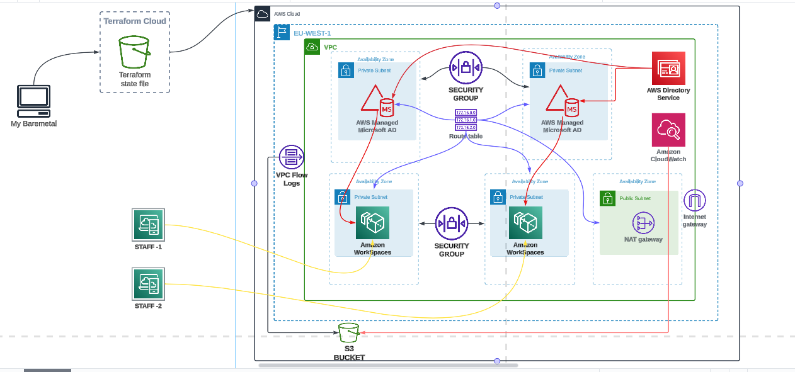

# final-year-project

[https://www.reddit.com/r/aws/comments/y8kxuq/can_i_mount_efs_to_an_instance_in_my_asg_launch/]

faced issues with the key

https://docs.aws.amazon.com/kms/latest/developerguide/key-policy-overview.html

https://repost.aws/questions/QUz-ungA4sRaqHqBz7Slb-sQ/kms-key-policy-to-allow-access-to-the-key-only-to-the-role-used-to-create-the-key

│ Error: creating CloudWatch Logs Log Group (Unilorin-Workspace): operation error CloudWatch Logs: CreateLogGroup, https response error StatusCode: 400, RequestID: 28e04bc9-50be-4c96-9af4-207b4c1f6531, api error AccessDeniedException: User: arn:aws:iam::851725342723:user/phamust1111@gmail.com is not authorized to perform: logs:CreateLogGroup on resource: arn:aws:logs:us-east-1:851725342723:log-group:Unilorin-Workspace:log-stream: because no identity-based policy allows the logs:CreateLogGroup action
│ 
│   with aws_cloudwatch_log_group.directory_log,
│   on cloudwatch.tf line 3, in resource "aws_cloudwatch_log_group" "directory_log":
│    3: resource "aws_cloudwatch_log_group" "directory_log" {
